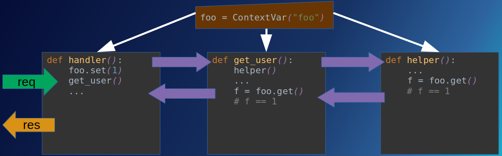
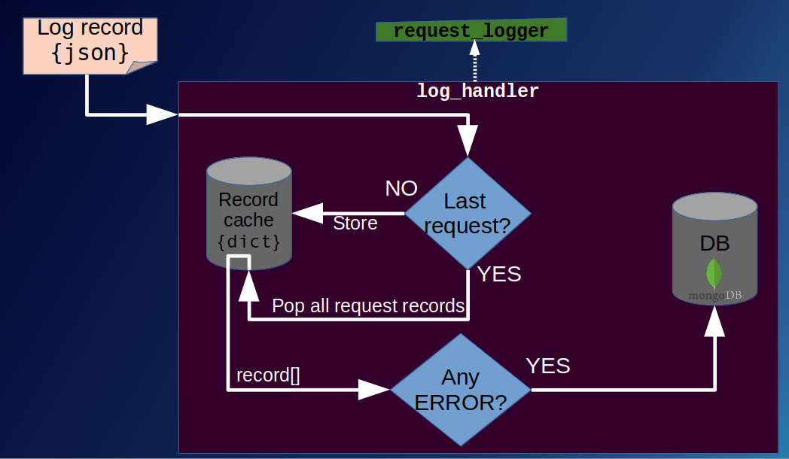

# Logging Requests POC

## Introduction

### TL;DR

- Having an API
- I want to add logging to all the functions involved in resolving the requests
- I need a way to identify to which individual request each log record corresponds
- Python natively features [context variables](https://docs.python.org/3/library/contextvars.html)
- But I will be using [loguru](https://github.com/Delgan/loguru), that already implements them on its logging system
- Additionally, I want to persist all the log records for failed requests on a database

### Full description

Having a service based on request handling (like a web service, a Telegram bot or an API), we want to group
log records identified by the unique request they were caused by.

The common workflow on these type of services usually are based on a request handler (function that receives the 
request and returns a response), and multiple misc functions (like services or helpers) called from the main
request handler to fulfill the request (like accessing a database, an external API/service, and so on).

All these functions (the main request handler and all the services and helpers involved) have their own
log records. But, as the service is usually async (so it can process multiple requests "at the same time"), we can end
having mixed log records for multiple requests, without knowing that record correspond to which individual request.

What we need is to track the context of each request, by appending a unique request identifier to each individual
request. While in Python we can use the built-in [context variables](https://docs.python.org/3/library/contextvars.html)
to do so, we will use the [loguru](https://github.com/Delgan/loguru) logging library, which already have a built-in
context system to transparently append context variables to the log records.

The main advantage of context variables is that they are created on the main request handler, and all the functions
called from the request handler can acquire their value. They do not required to be passed as function arguments.



## Technical parts

### API

As a demonstration, we have a simple API built with FastAPI, which serves endpoints to perform CRUD operations on an
entity called User. Users are stored on a MongoDB database (where the log records will be stored as well).

#### Endpoints

- GET /users
- GET /users/{user_id}
- DELETE /users/{user_id}
- POST /users - body:
  ```json
    {
      "username": "foo"
    }
  ```

_On [tools](tools) you can find scripts to POST successful and failing requests to create users_

#### Forcing an exception

- The API will throw an exception (resulting on a 500 status code response, thus a failed request) when trying to POST
  a User where the "username" field contains the word "fail".
- The API will record a WARNING on the logger when trying to POST a User where the "username" field contains the word "warn".

### Logging

We work with two different logs:
- A System Logger, used during initialization of the API and events related with it. Records are sent to sys.stderr.
- A Request Logger, for functions called while handling a request (the main handler and all the services and helpers)

_Since Loguru works with a single logger, we create "virtual" loggers by binding a context variable "logger_name"
to records (more information on the [logger.py](logging_requests_poc/logger.py) file)._

#### Request Log Handler (persisting failed requests log records)

Now that we have our request log records identified by each individual request, we want something else.
When a request fails, we want to persist ALL the log records of that request on a MongoDB collection.

For this, we create a custom log handling function, for each request log record, with the following logic inside:



Additionally, we can customize at which level the request record list will be stored (maybe not at ERROR, but at WARNING).

### Libraries used

- **fastapi** & **uvicorn** for the API
- **loguru** for the logging
- **pymongo** as the MongoDB connector (we should be using an async connector)
- **ward**, a new testing library (just for trying it out)
- **pydantic** for dataclasses (used by fastapi)
- **python-dotenv** & **dotenv-settings-handler** to load and handle settings through environment variables or .env file

## Running

```bash
git clone https://github.com/David-Lor/Logging-Requests-POC
cd Logging-Requests-POC

pip install -r requirements.txt
python .

# running tests
ward
```
